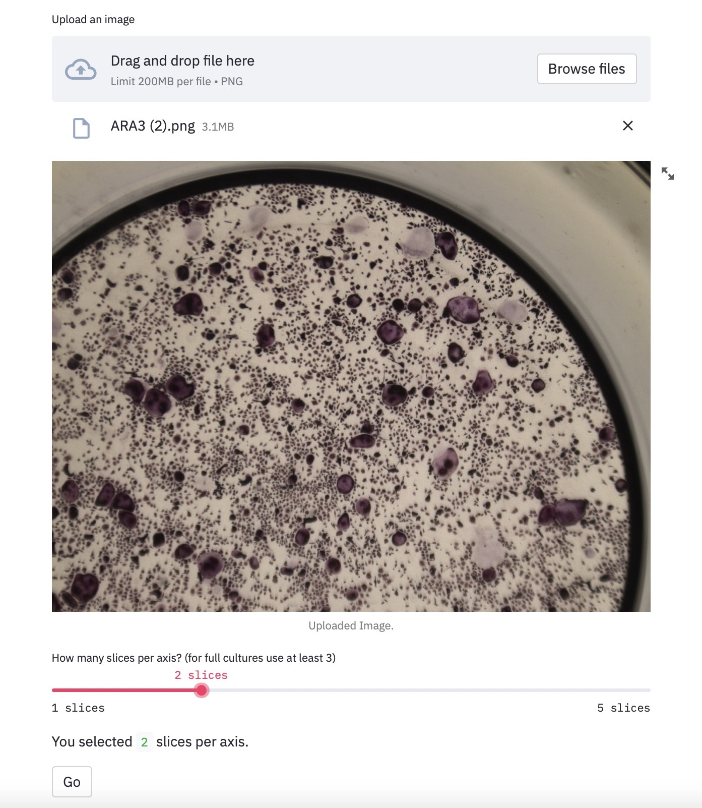
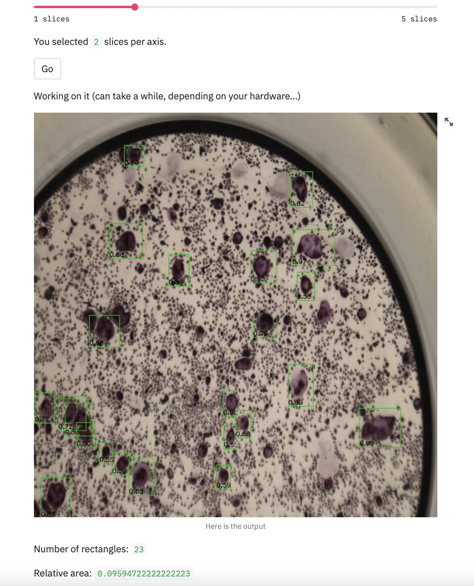

# Osteoclast Quantification Web App


Table of Contents :bookmark_tabs:
=================
- [Overview](#overview)
- [Installation](#installation)
- [Steps to Use the Application](#steps-to-Use-the-application)
- [Code and Resources Used](#code-and-resources-used)

## Overview
A simple web demo with minimal framework using PyTorch and Streamlit to showcase an image classification model

## Installation

- download and install conda for the relevant operating system:
https://docs.conda.io/projects/conda/en/latest/user-guide/install/index.html

- download and install git for the relevant operating system:
https://git-scm.com/book/en/v2/Getting-Started-Installing-Git

- open the conda interperter that was installed
- create a new virtual environment by typing in the interperter:
```
conda create --name osteoclast_quantification_env python=3.7
```

- activate the new environment by by typing in the interperter:
```
conda activate osteoclast_quantification_env
```

- navigate to the directory where you want to save the files, for example:
```
cd C:\User\myusername\Work
```

- clone the github repository by typing in the interperter:
```
git clone https://github.com/edocoh87/osteoclast_webapp.git
```

- install dependencies by typing in the interperter:
```
pip install -r requirements.txt
```

- run the webapp by typing in the interperter:
```
streamlit run streamlit_infer.py
```

## Steps to Use the Application

- Click 'Browse files' and upload an image file in png format



- Set the slider to the number of slices per axis (3 is a good configuration when uploading a full culture) and press the 'Go' button



- The run time depends on the slices per axis and the hardware used.

- Results include the total number of detected cells and the area cover by these cells.


## Code and Resources Used
- Python: Version 3.7
- Packages: PIL, torchvision, torch, streamlit, opencv-python
